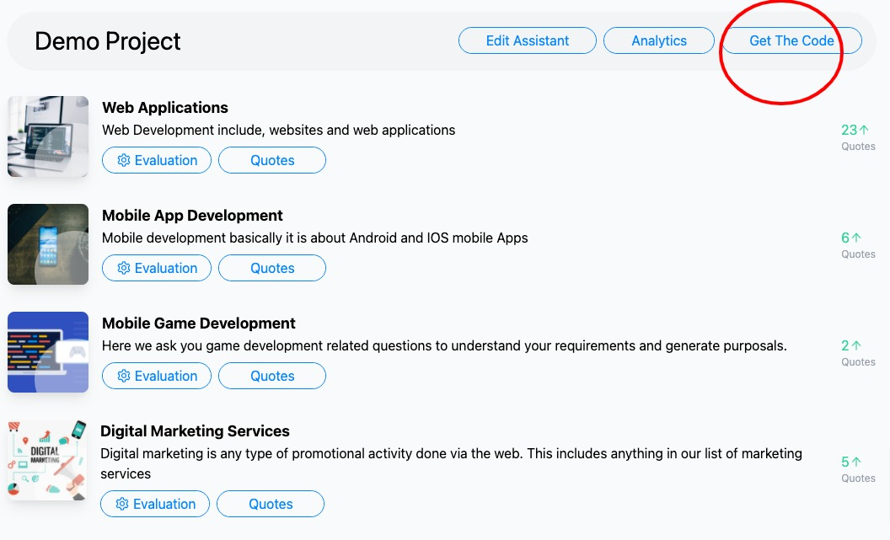

# Installation

To integrate Quoterules in your website or mobile app click the **Get The Code** button

### 1. Website integration as a chatbot

This type of integration is done to prompt quote assistant as chatbot, where code snippet is copied and pasted in the body section of your HTML page.

.png>)

.png>)

> Paste this code snippet in your common footer, then quote assistant will appear on all of your pages.&#x20;

Now when you visit your webpage, It will appear as this screenshot:

.png>)

You can change its appearance and color theme, from the **Edit Assistant** button in the dashboard more options:

.png>)

### 2. Integration as an iframe

This type of integration works best for mobile apps, where you can render this quote assistant as  web-view Or if you want to place this quote assistant to replace your contact form on the contact us page.

.png>)

#### Example:

.png>)

